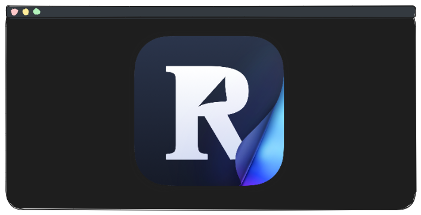
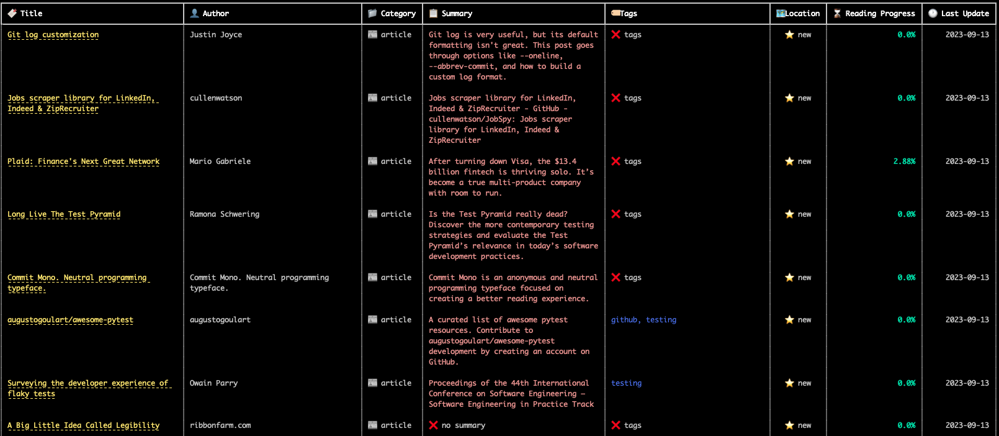
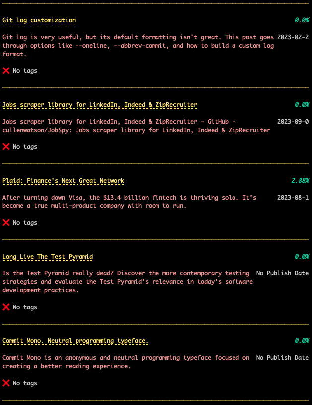

# Reader API Command-Line Interface



This repository provides a command-line interface (CLI) for interacting with [Readwise's Reader API](https://readwise.io/reader_api). This tool allows you to interact with the API directly from your command line, making it easy to `add`, `list`, and `update` documents from your Reader library.

Also, you can `upload` documents from your browser reading list, such as Chrome ReadingList.

Please note that future updates will include support for additional browsers.

## Installation

The easiest way to get started is with [`uv`](https://docs.astral.sh/uv/guides/tools/):

    uv tool install git+https://github.com/Scarvy/readwise-reader-cli

Then run:

    rw-cli --help

Alternatively, can run:

    uvx --from 'git+https://github.com/Scarvy/readwise-reader-cli' rw-cli --help

This will invoke the tool without installing it.

## Usage

Before using the CLI, make sure to set the READER_API_TOKEN environment variable. You can obtain your API token [here](https://readwise.io/access_token).


    export READER_API_TOKEN={your_api_token}


The CLI provides the following commands:

```bash
Usage: uv run rw-cli [OPTIONS] COMMAND [ARGS]...

  Interact with your Reader Library

Options:
  --help  Show this message and exit.

Commands:
  add       Add Document
  lib       Library breakdown
  list      List Documents
  update    Update Document
  upload    Upload Reading List File
  validate  Validate token
```

### List Documents

```bash
Usage: uv run rw-cli list [OPTIONS]

  List Documents

Options:
  -l, --location [new|archive|later|feed]
                                  Document(s) location
  -c, --category [article|tweet|pdf|epub|email|note|video|highlight|rss]
                                  Document(s) category
  -a, --update-after [%Y-%m-%d|%Y-%m-%dT%H:%M:%S|%Y-%m-%d %H:%M:%S]
                                  Updated after date in ISO format. Default:
                                  last 24hrs.
  -d, --date-range TEXT           View documents updated after choosen time:
                                  today, week, month.
  -L, --layout [table|list]       Display documents either as a list or table.
                                  Default: table.
  -n, --num-results INTEGER       The number of documents to show.
  -P, --pager                     Use to page output.
  --help                          Show this message and exit.
```

Examples:

See all documents located in archive:

    rw-cli list --location archive

See all articles located in archive:

    rw-cli list --location archive --category article

See all articles located in archive after Jan 1st, 2023

    rw-cli list --location archive --category article --update-after 2023-01-01

Same as above, but in a list format

    rw-cli list --location archive --category article --update-after 2023-01-01 --layout list

Can provide a date range like 'week' or 'month'

    rw-cli list --location archive --category article --date-range week


### Layouts





### Upload a Reading List (Google Chrome support only)

**THINGS TO NOTE:**

- **RATE LIMIT - Due to Reader's API rate limit of 20 requests per minute, a larger list will take a few minutes to upload.**

- **LACK OF READING LIST APIs - There is no API to pull your ReadingList from Google, but it is being looked at [here](https://bugs.chromium.org/p/chromium/issues/detail?id=1238372).**

To `upload` your Chrome Reading List, you first need to download your data from your account, then follow these steps:

1. Navigate to the [Data & Privacy](https://myaccount.google.com/data-and-privacy) section.
2. Find the "Download your data" option and click on it.
3. A list of data to export will appear. Click "Deselect all" and then locate the Chrome section.
4. Click "All Chrome data Included" and select ONLY "ReadingList".
5. Save the downloaded `.html` file to your preferred directory and take note of the file path.
6. Run the `import` command.

```bash
Usage: python -m readercli upload [OPTIONS] INPUT_FILE

  Upload Reading List File

Options:
  --file-type [html|csv]
  --help                  Show this message and exit.
```

Examples:

```bash
rw-cli upload /path/to/ReadingList.html
```

```bash
rw-cli upload --file-type csv /path/to/ReadingList.csv
```

### Add Document

```bash
Usage: rw-cli add [OPTIONS] URL

  Add Document

Options:
  -t, --tag TEXT  Tag(s) to add to the document. Can be used multiple times.
  --help          Show this message and exit.
```

Examples:

```bash
rw-cli add http://www.example.com
```

Add a document with tags:

```bash
rw-cli add http://www.example.com -t python -t tutorial
```

### Update Document

```bash
Usage: rw-cli update [OPTIONS] DOCUMENT_ID

  Update Document

Options:
  -t, --tag TEXT                  Tag(s) to set on the document. Can be used
                                  multiple times.
  -l, --location [new|archive|later|feed]
                                  Move document to location
  -T, --title TEXT                Update document title
  --help                          Show this message and exit.
```

Examples:

Add tags to an existing document:

```bash
rw-cli update 01abc123 -t ai -t learning
```

Move a document to archive:

```bash
rw-cli update 01abc123 --location archive
```

Update a document's title:

```bash
rw-cli update 01abc123 --title "New Title"
```

You can find document IDs from the API response when adding documents, or by inspecting results from `rw-cli list`.

### Library Overview

```bash
Usage: rw-cli lib [OPTIONS]

  Library breakdown

Options:
  -V, --view [category|location|tags]
  --help                          Show this message and exit.
```

Check library counts:

```bash
rw-cli lib

  Category Breakdown
┏━━━━━━━━━━━━━┳━━━━━━━┓
┃ Name        ┃ Count ┃
┡━━━━━━━━━━━━━╇━━━━━━━┩
│ 🖍️ highlight│   724 │
│ 📡️ rss      │   391 │
│ ✉️ email    │   363 │
│ 📰️ article  │   264 │
│ 📝️ note     │   140 │
│ 📄️ pdf      │    83 │
│ 🐦️ tweet    │    25 │
│ 📹️ video    │    10 │
│ 📖️ epub     │     0 │
└─────────────┴───────┘

python -m readercli lib --view [location | tags]

 Location Breakdown
┏━━━━━━━━━━━┳━━━━━━━┓
┃ Name      ┃ Count ┃
┡━━━━━━━━━━━╇━━━━━━━┩
│ 🗄️ archive│  1124 │
│ 🕑️ later  │   241 │
│ ⭐️ new    │    10 │
│ 📥️ feed   │     2 │
└───────────┴───────┘

rw-cli lib --view tags

Tags Breakdown
┏━━━━━━━━━━━━━━━━━━━━━━━━┳━━━━━━━┓
┃ Name                   ┃ Count ┃
┡━━━━━━━━━━━━━━━━━━━━━━━━╇━━━━━━━┩
│ python                 │    32 │
│ documentation          │     9 │
│ programming            │     7 │
│ github                 │     7 │
│ git                    │     6 │
│ packages               │     6 │
│ design-patterns        │     6 │
│ mac                    │     1 │
└────────────────────────┴───────┘
```

### Validate Token

```bash
Usage: rw-cli validate [OPTIONS] TOKEN

  Validate token

Options:
  --help  Show this message and exit.
```

## Main Third-Party Libraries

- [click](https://github.com/pallets/click)
- [pydantic](https://github.com/pydantic/pydantic)
- [requests](https://github.com/psf/requests)
- [rich](https://github.com/Textualize/rich)

## Inspiration

- [starcli](https://github.com/hedyhli/starcli)

## License

This project is licensed under the MIT License - see the [LICENSE](LICENSE) file for details.
